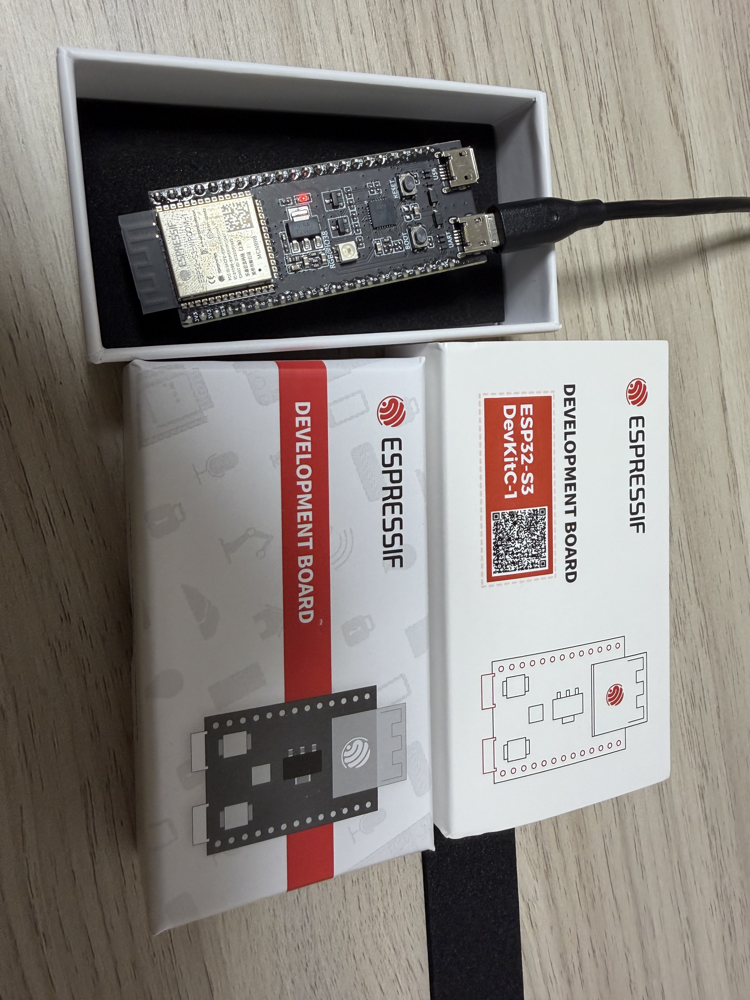

# 📡 ble-lab

> 自宅で受信機を回したら、近所のApple機器40台と隣家のiPhoneの状態が見えた個人検証ラボ。

ESP32-S3-DevKitC-1 を母艦に、Apple BLE Continuity プロトコルの送信側（BLE Spam）と受信側（広告解析）を手を動かして理解するための個人用ラボ。
最小の AppleJuice から始めて、EvilAppleJuice での MAC 自動ローテーション、近隣 BLE スキャナ、Nearby Info（subtype `0x10`）のデコードまで段階的に実装した。

Adafruit Trinkey QT2040 を使った **[bad-usb ラボ](https://github.com/masafykun/bad-usb-trinkey-lab) の無線版** にあたる位置付け。


🔗 **学習メモは Qiita 3部作で公開予定** → [① Core 3.x 罠](https://qiita.com/masafy/items/e50254ad76c801422a29) / [② BLE Scanner](https://qiita.com/masafy/items/2efbf20f5b9f03a2f3dc) / [③ Continuity 解析](https://qiita.com/masafy/items/fd4813cb861a80214eed)

---

## 📸 ハードウェア



秋月電子で 2,380 円。USB-C 2 ポート（UART 側を使う）、PSRAM 8MB、Flash 8MB。技適番号は基板上のシールド缶に刻印されている。

---

## ⚠️ 倫理ライン（毎回意識する）

- ✅ 自分が所有する ESP32-S3 + 自分の iPhone のみが検証対象
- ✅ 技適マーク付き正規品を使用、屋内・短時間のみ送信
- ✅ Qiita 記事は「個人検証ノート」のスタンスで書く（攻撃ペイロード集ではない）
- ✅ 受信したデータの MAC は記事掲載時に OUI 以外を伏字
- ❌ 他人のデバイス・公共の場・カフェ等での **送信** は絶対 NG（電波法・各種法令違反）
- ❌ 技適なし並行輸入 ESP32 は屋内でもアウト
- ❌ 取得した周辺デバイス情報を本人特定・時系列追跡に活用しない（ストーカー規制法）

迷ったら「これは記事で公開して恥ずかしくないか？」で判断する。

---

## ✨ 特徴

- **段階的に動く 4 つのスケッチ** — 単機種 BLE 広告 → 29 機種ローテーション → 周辺スキャナ → Continuity 解析
- **iOS 17.2+ 対策の効きを実機観察** — MAC 自動ランダム化 + 29 機種ローテで通知サプレッションを擦り抜ける挙動を可視化
- **ESP32 Core 3.x → 2.0.17 ダウングレード手順** — ESP32-S3 で Bluedroid が使えなくなる罠を回避
- **Apple Continuity デコーダ** — Nearby Info (`0x10`) のビットフラグを `furiousMAC/continuity` 等の OSS 解析に従ってデコード

---

## 🛠️ 環境

| 項目 | 内容 |
|---|---|
| メイン基板 | ESP32-S3-DevKitC-1-N8R8（秋月電子） |
| 技適番号 | **201-220052** |
| ホスト | MacBook（Apple Silicon） + Arduino IDE 2.3.8 |
| ESP32 Arduino Core | **2.0.17 固定**（3.x 系は ESP32-S3 で NimBLE に切り替わり既存 BLE スケッチが動かない） |
| BLE スタック | Bluedroid（Core 2.0.17 デフォルト） |
| シリアル | `/dev/cu.usbserial-XXX`（CP2102N、macOS 標準ドライバで認識） |

---

## 📁 ディレクトリ構成

```
ble-lab/
├── README.md                          このファイル
├── CLAUDE.md                          Claude Code セッション開始手順
├── BUILD_LOG.md                       日付つき作業ログ
├── LICENSE                            MIT
├── sketches/                          Arduino スケッチへのリンク場所（実体は ~/Documents/Arduino/）
├── article/                           Qiita 記事ソース (qiita-cli 運用)
│   └── public/
│       ├── 01-esp32s3-applejuice-core3-trap.md
│       ├── 02-ble-scanner-home-bledevices.md
│       └── 03-apple-continuity-iphone-state-leak.md
└── photos/                            記事用スクショ・写真
```

実際のスケッチは Arduino IDE の都合上 `~/Documents/Arduino/` 配下：

- `AppleJuice/`                  — Apple Juice 単機種版
- `EvilAppleJuice-ESP32/`        — 29 機種 + MAC 自動ローテーション
- `BLEScanner/`                  — 周辺 BLE 可視化
- `ContinuityAnalyzer/`          — Apple Continuity 状態漏洩解析

---

## 🚀 セットアップ（要点）

詳細は [Qiita 記事①](https://qiita.com/masafy/items/e50254ad76c801422a29) を参照。要点だけ：

```bash
# 1. Arduino IDE 2.x をインストール
#    https://www.arduino.cc/en/software

# 2. 追加のボードマネージャ URL を設定
#    Preferences → Additional boards manager URLs に:
#    https://raw.githubusercontent.com/espressif/arduino-esp32/gh-pages/package_esp32_index.json

# 3. ボードマネージャで esp32 by Espressif Systems の 2.0.17 をインストール
#    (3.x は ESP32-S3 で NimBLE に切り替わり既存スケッチが動かない)

# 4. Tools メニューでボード設定
#    Board: ESP32S3 Dev Module
#    Port: /dev/cu.usbserial-XXX
#    PSRAM: OPI PSRAM
#    Flash Size: 8MB (64Mb)

# 5. お好みのスケッチを書き込み
git clone https://github.com/ckcr4lyf/EvilAppleJuice-ESP32.git ~/Documents/Arduino/EvilAppleJuice-ESP32
# → Arduino IDE で開いてコンパイル → 書き込み
```

---

## 関連プロジェクト

- [bad-usb-trinkey-lab](https://github.com/masafykun/bad-usb-trinkey-lab) — Adafruit Trinkey QT2040 による HID 注入ラボ（BLE ラボの **有線版**）

---

## ライセンス

[](https://opensource.org/licenses/MIT)

このプロジェクトは **MIT ライセンス** のもとで公開しています。

© 2026 masafykun (https://github.com/masafykun)
